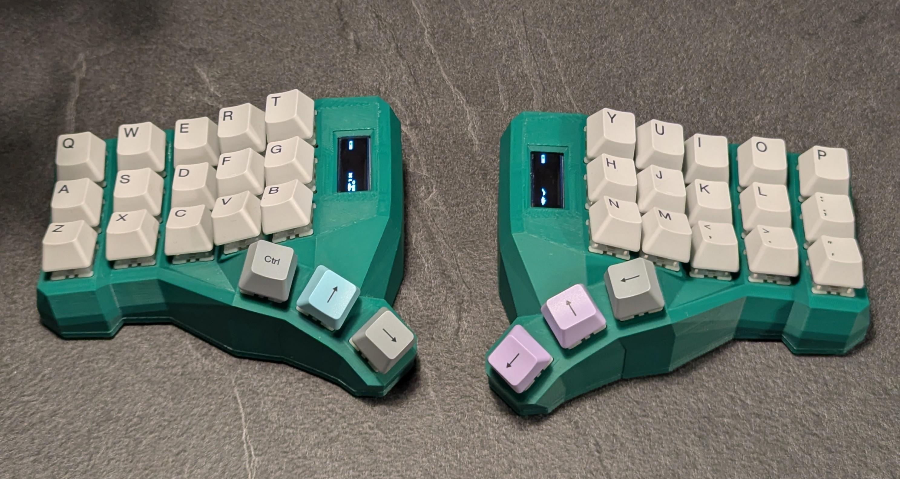

# MINIDOX Dactyl Keyboard

A custom split ergonomic keyboard with a minimalist column-staggered layout. This repository contains all the necessary information and files to build your own MINIDOX Dactyl keyboard.

## Features

- **Split design**: Two separate halves for better ergonomics
- **Compact layout**: 5 columns × 3 rows plus 3 thumb keys per half (36 keys total)
- **Ergonomic**: Contoured design follows the natural positioning of fingers
- **Wireless**: Powered by nice!nano v2 controllers with Bluetooth connectivity
- **Long battery life**: Uses 18650 lithium-ion batteries
- **OLED displays**: Information at a glance on both halves
- **Customizable firmware**: Built with ZMK for ultimate flexibility

## Hardware Requirements

### Components

- 2× nice!nano v2 controllers
- 2× 18650 lithium-ion batteries
- 36× MX compatible switches
- 36× 1N4148 diodes
- 2× OLED displays (128×32)
- 2× On/Off switches
- 2× Reset buttons
- 2× JST battery connectors
- M2.5 6mm screws (for case assembly)
- USB-C cable (for initial flashing and charging)

### Tools

- Soldering iron and solder
- Wire stripper
- Wire cutter
- Small screwdriver
- 3D printer (or access to 3D printing services)

## 3D Printing

The `3d_models` folder contains all required 3D models for printing:
- Keyboard case (top part)
- Switch plate
- Bottom plate
- Battery holder

Print recommendations:
- Material: PLA or PETG
- Layer height: 0.12mm
- Infill: 15-20%
- Support: Yes, for the contoured case design

Assembly instructions:
1. The keyboard plate screws to the top model part (keyboard body) using M2.5 6mm screws
2. The bottom plate attaches to the main case to house the electronics and battery

## Firmware

This keyboard uses [ZMK Firmware](https://zmk.dev/), an open-source keyboard firmware built on the Zephyr RTOS that provides Bluetooth Low Energy connectivity.

### Default Keymap

The keyboard has 4 layers:
- Default: QWERTY layout
- Raise: Function and navigation keys
- Lower: Numbers and symbols
- Numpad: Dedicated numpad and media controls

### Change Keymap

You can use [Keymap Editor](https://nickcoutsos.github.io/keymap-editor/) to change the keyboard layout. 
You have to link the forked github project and it will crate a merge request with the new layout and automatically trigger the build stage

### Customizing Firmware

1. Fork this repository
2. Modify the files in the `config` folder:
   - `vireal_dactyl.keymap` - Edit the keymap to your preferences
   - `vireal_dactyl.conf` - Adjust configuration settings if needed
3. Commit your changes to trigger the GitHub Actions workflow
4. Download the firmware files from the Actions tab on GitHub

### Flashing Instructions

1. Put your nice!nano in bootloader mode:
   - Press the reset button twice in quick succession
   - The controller will appear as a USB drive on your computer
2. Drag and drop the appropriate `.uf2` file onto the USB drive:
   - `vireal_dactyl_left-nice_nano_v2-zmk.uf2` for the left half
   - `vireal_dactyl_right-nice_nano_v2-zmk.uf2` for the right half
3. The controller will automatically reset and disconnect
4. Repeat for the other half

## Hardware Assembly

### Wiring Diagram

The keyboard uses a matrix wiring layout with 4 rows and 10 columns (5 per half):

- Rows are connected to pins 6, 7, 8, and 9 on the nice!nano
- Columns (left half) are connected to pins 10, 14, 15, 16, and 18
- Columns (right half) are connected to pins 10, 14, 15, 16, and 18
- OLED displays connect via I2C on pins 20 (SDA) and 22 (SCL)

### Power Management

- The on/off switch controls power to the nice!nano
- Connect the 18650 battery to the JST connector on the nice!nano
- Make sure the battery polarity is correct to avoid damage

## Features and Usage

### Power Switch

The switch turns the keyboard on and off, which helps conserve battery life when not in use.

### Reset Button

- Press once: Keyboard will reset and reconnect
- Press twice quickly: Controller enters bootloader mode for firmware flashing

### Displays

Both halves have OLED displays that show:
- Current layer
- Battery status
- Bluetooth connection status

### Battery Life

With the 18650 battery, you can expect approximately:
- 2-3 months of use with displays enabled
- 4-6 months with displays disabled

## Troubleshooting

### Common Issues

1. **Keyboard not turning on**
   - Check battery connection
   - Ensure battery is charged
   - Verify the power switch is in the ON position

2. **Halves not connecting**
   - Reset both halves
   - Ensure both halves have the correct firmware

3. **Unable to enter bootloader mode**
   - Connect via USB
   - Try pressing the reset button a bit faster
   - If still not working, try shorting the RST and GND pins directly

For more advanced troubleshooting, check the [ZMK documentation](https://zmk.dev/docs/troubleshooting).

## Contributing

Pull requests are welcome. For major changes, please open an issue first to discuss what you would like to change.

## License

This project is licensed under the MIT License - see the LICENSE file for details.

## Acknowledgments

- [ZMK Firmware](https://zmk.dev/)
- [Dactyl Keyboard](https://github.com/adereth/dactyl-keyboard) - Original inspiration
- [MiniDox](https://github.com/That-Canadian/MiniDox_PCB) - Layout inspiration
- The mechanical keyboard community
